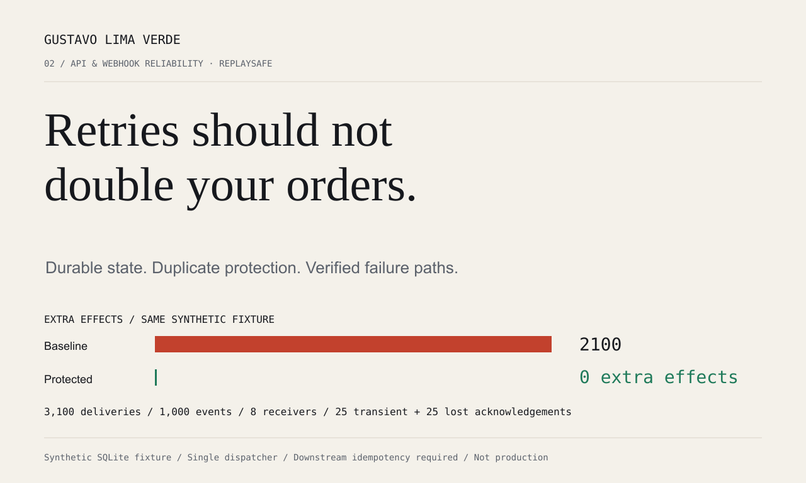
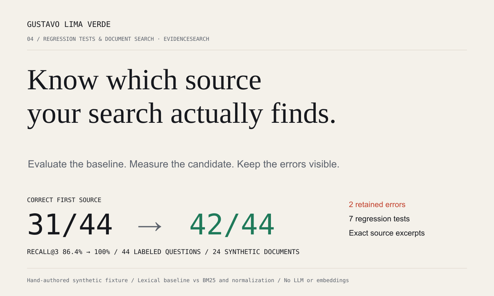

# Gustavo Lima Verde · software evidence

[](https://github.com/GustavoPMLV/freelance-software-evidence/actions/workflows/verify.yml)

AI-assisted technical demonstrations with rerunnable tests, measured baselines and disclosed limits. Gustavo coordinates the project and its acceptance criteria; advanced AI tools support implementation, testing and documentation. These synthetic demonstrations are not claims of previous client work.

## EngramaMed · own educational SaaS

[EngramaMed](https://engramamed.com.br) is Gustavo Lima Verde's own educational SaaS for medical study and residency-exam preparation. This repository contains a link to the product; it does not contain EngramaMed's application source, authenticated screens, medical content or internal data. No user, revenue or clinical-outcome figures are claimed here.

## ReplaySafe · retries without duplicate effects



A durable SQLite inbox/outbox handles event identity, concurrent duplicates, transactional effects, restarts, retries and explicit failures.

| Executed fixture | Outcome |
|---|---:|
| Deliveries / unique events | 3,100 / 1,000 |
| Concurrent receivers | 8 |
| Unprotected / protected extra effects | 2,100 / 0 |
| Transient failures / lost acknowledgements | 25 / 25 |
| Regression checks | 13 |

The downstream provider supports idempotency keys. One dispatcher is used. This fixture does not establish production throughput or a universal exactly-once guarantee. [Case and limits](portfolio/CASE_REPLAYSAFE.md) · [Implementation](technical/replaysafe.py).

## EvidenceSearch · measure document retrieval



A scored pipeline is compared with exact-token lexical retrieval on 44 labeled questions and 24 synthetic policy documents. Both pipelines apply the same tenant and role filters.

| Metric | Baseline | Candidate |
|---|---:|---:|
| Correct first source | 31/44 | 44/44 |
| Recall at 3 | 0.8636 | 1.0000 |
| MRR at 3 | 0.7841 | 1.0000 |

Fifteen retrieval tests cover the unchanged 44-query fixture, 22 additional development questions, ranking regressions, access controls, result limits, exact excerpts and reproducibility. The revised pipeline scores 44/44 on the original fixture and 22/22 on the additional development set. The latter is not a blind holdout. The authored fixture is not a held-out real-world evaluation. No LLM inference, embeddings or paid service runs. [Case and verified evaluation](portfolio/CASE_EVIDENCESEARCH.md) · [All query outcomes](evidence/results.json).

## Reproduce

Python 3.12+; standard library only.

```bash
git clone https://github.com/GustavoPMLV/freelance-software-evidence.git
cd freelance-software-evidence/technical
python3 run_evidence.py
```

This executes 28 regression tests and regenerates the synthetic results. Source hashes bind the evidence to the implementation. No live APIs, customer records or financial transactions are used.

To view the standalone English, Portuguese and Spanish portfolio:

```bash
cd ..
python3 -m http.server 8766 --directory portfolio
```

Open `http://localhost:8766` or `http://localhost:8766/pt.html` or `http://localhost:8766/es.html`. The brief builder prepares text locally and submits nothing.

## Português

Portfólio técnico de Gustavo Lima Verde com demonstrações reproduzíveis de proteção contra efeitos duplicados em webhooks e avaliação de busca documental. Dados sintéticos, resultados de testes executados e limites declarados. EngramaMed aparece primeiro como SaaS educacional próprio. A implementação utiliza apoio de IA, comunicação escrita e escopo combinado antes de cada trabalho.

[Perfil no Upwork](https://www.upwork.com/freelancers/~0153456be778467e4e)

## Verified improvements (2026-10-03)

Both previously incorrect first-source choices were repaired without changing the original queries, expected labels or documents. The frozen corpus digest is a59178860cbbed932978b83490cc7371b35d987dd44fc04c81d5b96d81eab46f. ReplaySafe also explicitly closes SQLite connections; a Linux stress check with garbage collection disabled guards against descriptor accumulation. The published results are synthetic fixture evidence, not universal production guarantees. Written collaboration is available in Portuguese, English and Spanish with AI assistance; meetings in Portuguese and basic spoken English/Spanish.

## B2B pilot: batch comparison

[Conferência de Lotes](https://gustavo-lima-verde-software.gustavo-pmlv6.chatgpt.site/b2b/) is a functional pilot for comparing approved-order CSVs against an ERP import file by order/SKU, integer quantity and exact unit-price cents. It runs locally in the browser, blocks duplicate or invalid keys, reports physical source lines and exports CSV/JSON. It does not connect to or approve an ERP import.

The [source, limits and run instructions](b2b/README.md) describe the reference format. Twenty-two engine tests cover malformed CSV, duplicate identity, exact arithmetic, spreadsheet-safe reports and 10,000-record batches. PT/EN/ES pages and 320/390/1366px layouts were checked locally. Commercial configuration is a proposed bounded pilot; no buyers, license revenue or recurring revenue have been validated.

Claude Opus 5.5 at xhigh effort supplied the visual direction and the final multilingual commercial pages; Codex built and tested the engine and runtime. Higgsfield brandkit was used locally for review boards and an original vector diagram. No cloud generation was completed.
